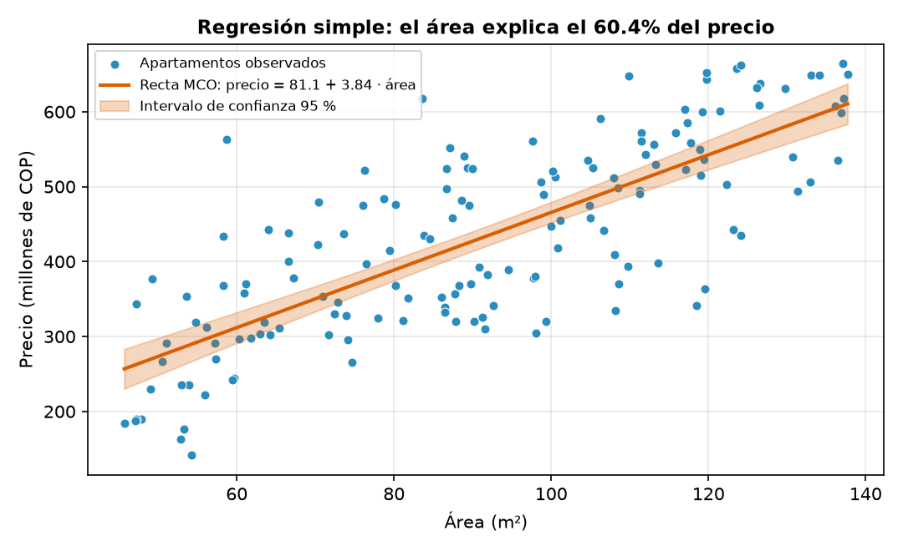
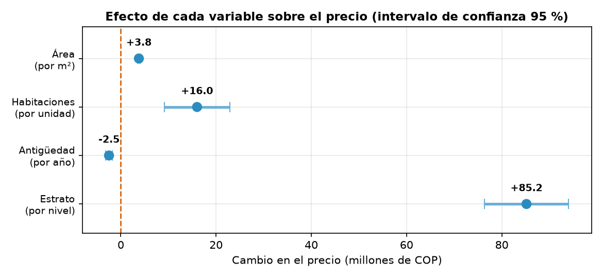
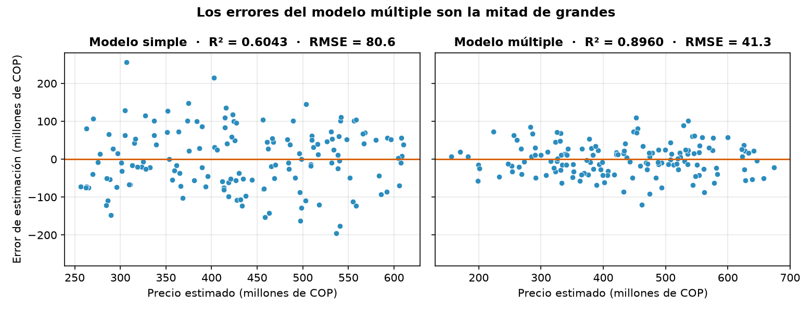
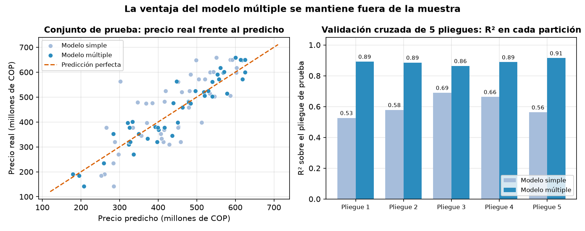
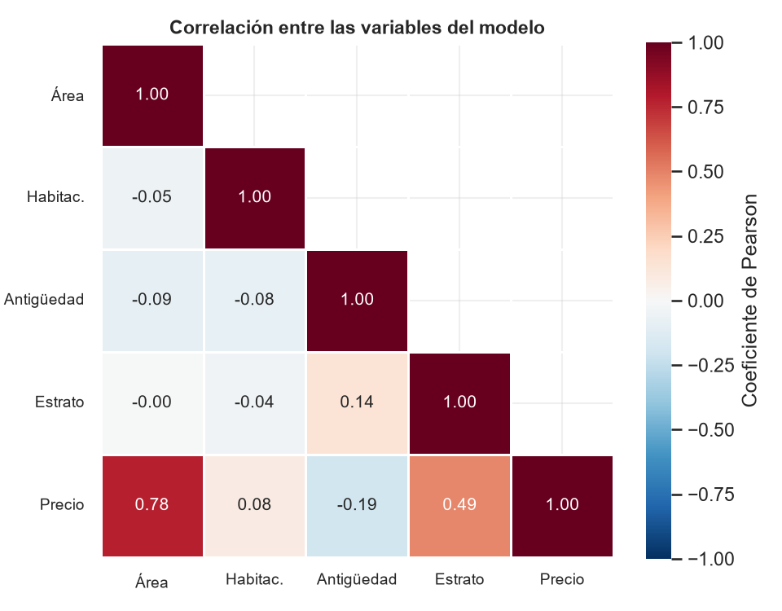
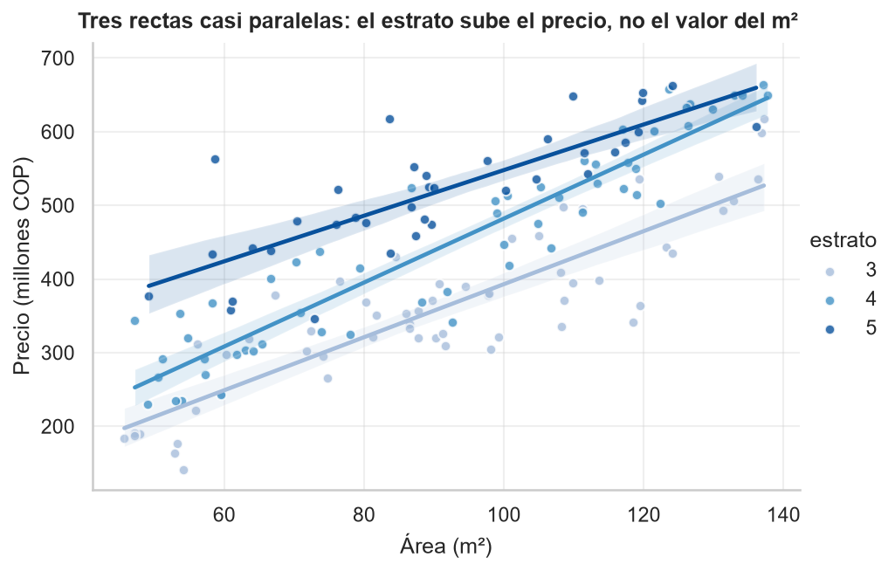
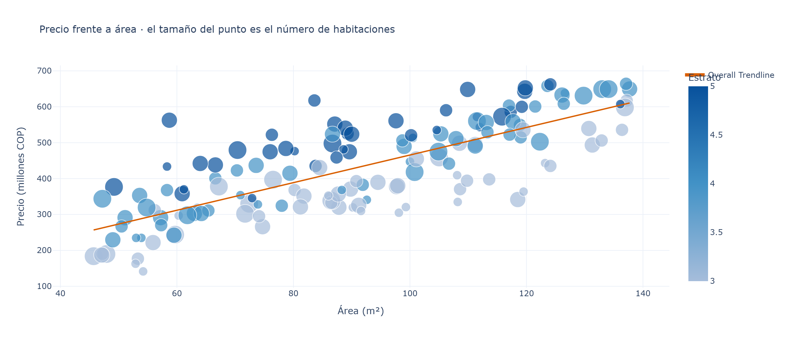

<div align="center">
    
</div>

# Análisis de Regresión y Visualización Avanzada

## 📋 Información General

<div align="center">
    
</div>

| Aspecto | Detalles |
|--------|----------|
| **Autor** | Andrés Giovanny Rubiano Muñoz "Andy Rubiano" |
| **Correo** | arubiano67@unisalle.edu.co |
| **Asignatura** | Ciencia de Datos — Actividad 4 |
| **Programa** | Maestría en Inteligencia Artificial |
| **Universidad** | Universidad de La Salle |
| **Herramientas** | Python 3.14 (statsmodels · scikit-learn · Matplotlib · seaborn · Plotly) y R 4.6 (`lm` · ggplot2) |
| **Año** | 2026 |
| **Estado** | Completado |

---

## 🎯 Descripción del Proyecto

Análisis de regresión sobre el **precio de 150 apartamentos usados en Bogotá**, descritos por cuatro características que cualquier avalúo mira primero: **área, número de habitaciones, antigüedad y estrato**.

La pregunta es una sola y se responde en cuatro pasos:

> **¿Qué determina el precio de un apartamento y con cuánta precisión se puede estimar?**

1. **La correlación sugiere una respuesta incompleta.** El área es la variable más asociada al precio (r = 0,78), mientras que el número de habitaciones parece irrelevante (r = 0,08, p = 0,33).
2. **La regresión simple confirma que el área importa, pero no basta.** `precio ~ área` explica el **60,4 %** de la variabilidad y se equivoca en promedio 66,7 millones por apartamento.
3. **La regresión múltiple cambia el diagnóstico.** Al incluir las cuatro variables el R² sube a **0,896** y las habitaciones resultan **altamente significativas** (+16,0 millones cada una): lo que la correlación simple no veía, el modelo múltiple sí lo aísla.
4. **La mejora se sostiene fuera de la muestra.** Sobre 45 apartamentos que el modelo nunca vio, el R² es **0,8955** y el error medio, **34,8 millones (8,1 % del precio)**. `lm()` en R reproduce los cinco coeficientes con diferencia **0,000000**.

### Objetivos Principales

- Medir la asociación de cada característica con el precio y ajustar la regresión lineal simple con `statsmodels`.
- Estimar la regresión múltiple e interpretar cada coeficiente **manteniendo constantes las demás variables**.
- Comparar ambos modelos con R², R² ajustado y error medio de predicción.
- Validar con `scikit-learn` que la mejora no es sobreajuste (partición 70/30 y validación cruzada de 5 pliegues).
- Comunicar los resultados con Matplotlib, seaborn y un **tablero interactivo de Plotly**.
- Reproducir todo en R con `lm()` y ggplot2 como verificación independiente.

---

## 📚 Estructura del Repositorio

```
.
├── README.md                                  # Este archivo
├── requirements.txt                           # Dependencias de Python
├── .gitignore                                 # Excluye venv/, __pycache__/, .Rhistory, .vscode/
├── data/
│   ├── dataset/
│   │   └── viviendas.csv                      # 150 apartamentos (semilla 42, reproducible)
│   └── processed/
│       ├── correlaciones.csv                  # Pearson de cada variable con el precio
│       ├── regresion_simple.csv               # Coeficientes del modelo simple con IC 95 %
│       ├── regresion_multiple.csv             # Coeficientes del modelo múltiple con IC 95 %
│       ├── comparacion_modelos.csv            # R², R² ajustado, RMSE, MAE y AIC
│       ├── validacion_sklearn.csv             # Prueba retenida y validación cruzada
│       ├── regresion_multiple_r.csv           # Los mismos coeficientes estimados con lm()
│       └── verificacion_python_r.csv          # Diferencia coeficiente a coeficiente
├── public/
│   └── assets/
│       └── images/
│           ├── Logo.png                       # Logo institucional
│           ├── author/                        # Foto del autor
│           └── figures/
│               ├── python/
│               │   ├── regression/            # 4 figuras de Matplotlib
│               │   ├── advanced/              # 3 figuras de seaborn
│               │   └── dashboard/             # 2 piezas interactivas de Plotly (HTML + PNG)
│               └── r/                         # 3 figuras de ggplot2
└── utils/
    └── codes/
        ├── python/
        │   ├── dataset.py                     # Fase 1 · generación del dataset
        │   ├── regression.py                  # Fase 2 · statsmodels: simple y múltiple
        │   ├── validation.py                  # Fase 3 · scikit-learn: validación
        │   └── visualization.py               # Fase 4 · seaborn y tablero de Plotly
        └── R/
            └── regression.R                   # Fase 5 · lm() y ggplot2
```

---

## 🧪 Pipeline del Laboratorio

Cinco scripts, uno por fase. El flujo es **secuencial**: la Fase 1 genera el dataset que consumen las demás.

| Fase | Script | Herramienta | Qué produce |
|---|---|---|---|
| 1 | [`dataset.py`](utils/codes/python/dataset.py) | numpy · pandas | Dataset reproducible de 150 apartamentos |
| 2 | [`regression.py`](utils/codes/python/regression.py) | statsmodels · Matplotlib | Correlaciones, modelo simple, modelo múltiple y 3 figuras |
| 3 | [`validation.py`](utils/codes/python/validation.py) | scikit-learn · Matplotlib | Partición 70/30, validación cruzada y 1 figura |
| 4 | [`visualization.py`](utils/codes/python/visualization.py) | seaborn · Plotly | 3 figuras estáticas y 2 piezas interactivas |
| 5 | [`regression.R`](utils/codes/R/regression.R) | `lm` · ggplot2 | Verificación cruzada y 3 figuras |

**Reproducibilidad:** semilla fija (`default_rng(42)` en la generación y `random_state=42` en las particiones). Cualquier ejecución produce exactamente las mismas cifras que aparecen en este documento.

---

## ⚙️ Requisitos

### Python

> ⚠️ **Versión:** Python 3.10 o superior (probado en **3.14.7**), con entorno virtual dedicado (`venv/`).

| Dependencia | Versión probada | Uso |
|---|---|---|
| `numpy` | 2.5.2 | Generación del dataset y mallas de predicción |
| `pandas` | 3.0.5 | Manejo del dataset y de todas las tablas |
| `scipy` | 1.18.0 | Coeficiente de correlación de Pearson |
| `statsmodels` | 0.14.6 | Estimación por MCO e inferencia sobre los coeficientes |
| `scikit-learn` | 1.9.0 | Partición entrenamiento/prueba y validación cruzada |
| `matplotlib` | 3.11.1 | Figuras de ajuste, residuos, efectos y validación |
| `seaborn` | 0.13.2 | Matriz de dispersión, mapa de calor y ajuste por estrato |
| `plotly` | 6.9.0 | Tablero interactivo y dispersión explorable |
| `kaleido` | 1.3.0 | Motor que exporta las figuras de Plotly a PNG |

### R

- **R 4.x** (probado en **4.6.1**) con **ggplot2**: `install.packages("ggplot2")`.
- `lm()`, `anova()` y `confint()` son parte de la instalación base.
- Editor: RStudio Desktop o VS Code con la extensión **R** (REditorSupport) + `languageserver`.

---

## 🛠️ Ejecución

> Todos los comandos se lanzan **desde la raíz del proyecto**.

```bash
# 1. Entorno de Python
py -3.14 -m venv venv           # o `python -m venv venv` si 3.14 ya es el intérprete por defecto
source venv/Scripts/activate    # Git Bash (en PowerShell: venv\Scripts\activate)
pip install -r requirements.txt

# 2. Fases 1 a 4
python utils/codes/python/dataset.py
python utils/codes/python/regression.py
python utils/codes/python/validation.py
python utils/codes/python/visualization.py

# 3. Fase 5: verificación en R
Rscript utils/codes/R/regression.R
```

Si `Rscript` no está en el `PATH` de Git Bash, añádelo a la sesión antes del último paso:

```bash
export PATH="/c/Program Files/R/R-4.6.1/bin:$PATH"
```

---

## 📊 Los datos

`viviendas.csv` contiene 150 apartamentos usados con seis columnas:

| Columna | Tipo | Rango observado | Descripción |
|---|---|---|---|
| `inmueble_id` | texto | AP-001 … AP-150 | Identificador del apartamento |
| `area_m2` | numérica | 45,7 – 137,7 | Área construida en metros cuadrados |
| `habitaciones` | entera | 1 – 4 | Número de habitaciones |
| `antiguedad_anios` | entera | 0 – 35 | Años desde la construcción |
| `estrato` | entera | 3 – 5 | Estrato socioeconómico |
| `precio_millones_cop` | numérica | 141,5 – 663,9 | **Variable respuesta**: precio en millones de COP |

El precio promedio es de **431,3 millones de COP** con una desviación estándar de 128,6.

---

## 📈 Fase 2 · Correlación y regresión simple

### La correlación por sí sola da una respuesta incompleta

| Variable | Pearson r | p-valor | Lectura |
|---|---|---|---|
| **Área (m²)** | **0,7774** | 1,4 × 10⁻³¹ | Asociación fuerte y positiva |
| Estrato | 0,4872 | 2,6 × 10⁻¹⁰ | Asociación moderada |
| Antigüedad (años) | −0,1946 | 0,017 | Asociación débil y negativa |
| Habitaciones | 0,0807 | **0,326** | **Sin asociación detectable** |

El número de habitaciones parece no tener relación con el precio. El modelo múltiple mostrará que esa conclusión es falsa: la correlación mide la relación de dos variables **ignorando todo lo demás**, y aquí "todo lo demás" incluye el área, que domina el precio y esconde el efecto de las habitaciones.

### El modelo simple: `precio ~ área`

| Término | Coeficiente | Error estándar | t | p-valor | IC 95 % |
|---|---|---|---|---|---|
| Intercepto | 81,085 | 24,220 | 3,35 | 1,0 × 10⁻³ | [33,22 ; 128,95] |
| **Área (m²)** | **3,845** | 0,256 | 15,03 | 1,4 × 10⁻³¹ | [3,34 ; 4,35] |

El modelo estimado es **precio = 81,1 + 3,85 · área**, y su pendiente se lee directamente: **cada metro cuadrado adicional suma 3,85 millones de COP** al precio. El R² es **0,6043**, así que el área explica el 60 % de la variabilidad y deja el 40 % restante sin explicar.

<div align="center">
    
</div>

**Ajuste por mínimos cuadrados** — la banda naranja es el intervalo de confianza al 95 % de la recta. La dispersión vertical de los puntos alrededor de ella es, visualmente, lo que las otras tres variables tendrán que explicar.

---

## 📐 Fase 2 · Regresión múltiple y comparación de modelos

Al añadir habitaciones, antigüedad y estrato, **las cuatro variables resultan significativas**, incluida la que la correlación descartaba:

| Término | Coeficiente | Error estándar | t | p-valor | IC 95 % | Significativo |
|---|---|---|---|---|---|---|
| Intercepto | −237,026 | 24,137 | −9,82 | 9,2 × 10⁻¹⁸ | [−284,73 ; −189,32] | sí |
| **Área** (por m²) | **+3,797** | 0,133 | 28,51 | 2,5 × 10⁻⁶¹ | [3,53 ; 4,06] | sí |
| **Habitaciones** (por unidad) | **+16,010** | 3,482 | 4,60 | 9,2 × 10⁻⁶ | [9,13 ; 22,89] | sí |
| **Antigüedad** (por año) | **−2,475** | 0,359 | −6,90 | 1,5 × 10⁻¹⁰ | [−3,18 ; −1,77] | sí |
| **Estrato** (por nivel) | **+85,185** | 4,440 | 19,18 | 1,3 × 10⁻⁴¹ | [76,41 ; 93,96] | sí |

<div align="center">
    
</div>

**Cada coeficiente responde una pregunta de negocio distinta**, siempre *manteniendo constantes las demás variables*:

- Cada **m²** adicional vale **3,80 millones**.
- Cada **habitación** adicional suma **16,0 millones** — el equivalente a 4,2 m².
- Cada **año de antigüedad** resta **2,48 millones**; en diez años, 24,8 millones (6,5 m²).
- Subir **un nivel de estrato** vale **85,2 millones**, tanto como 22,4 m² adicionales.

> **El hallazgo central.** Las habitaciones pasan de `p = 0,326` (irrelevantes) a `p = 9,2 × 10⁻⁶` (altamente significativas). No cambió el dato: cambió la pregunta. La correlación pregunta *"¿los apartamentos con más habitaciones son más caros?"* y la respuesta es "no necesariamente, porque hay apartamentos pequeños con tres habitaciones y grandes con dos". La regresión múltiple pregunta *"entre dos apartamentos de la misma área, antigüedad y estrato, ¿vale más el que tiene una habitación extra?"* y la respuesta es sí, 16 millones más.

### Comparación de los dos modelos

| Modelo | Fórmula | Variables | R² | R² ajustado | RMSE | MAE | AIC |
|---|---|---|---|---|---|---|---|
| Simple | `precio ~ área` | 1 | 0,6043 | 0,6016 | 80,60 | 66,72 | 1 746,5 |
| **Múltiple** | `precio ~ área + habitaciones + antigüedad + estrato` | 4 | **0,8960** | **0,8932** | **41,32** | **33,07** | **1 552,1** |

El R² ajustado sube igual que el R², de modo que la mejora no es el efecto mecánico de agregar variables. El error medio de estimación **cae a la mitad**, de 66,7 a 33,1 millones.

<div align="center">
    
</div>

**Los errores de ambos modelos en la misma escala** — a la izquierda el modelo simple, con errores que llegan a ±250 millones; a la derecha el múltiple, con la nube claramente más estrecha y centrada en cero.

---

## 🤖 Fase 3 · Validación con scikit-learn

Un R² alto sobre los mismos datos con los que se ajustó el modelo no prueba nada: hay que medirlo sobre apartamentos que el modelo **nunca vio**.

| Modelo | R² entrenamiento | R² prueba | RMSE prueba | MAE prueba | R² validación cruzada |
|---|---|---|---|---|---|
| Simple | 0,6135 | 0,5744 | 88,15 | 75,29 | 0,6041 ± 0,0620 |
| **Múltiple** | 0,8934 | **0,8955** | **43,69** | **34,75** | **0,8888 ± 0,0162** |

<div align="center">
    
</div>

Tres lecturas de esta tabla:

- **No hay sobreajuste.** La brecha entre entrenamiento y prueba del modelo múltiple es de **−0,0021**: el modelo se comporta igual de bien dentro y fuera de la muestra.
- **La ventaja es consistente.** En los cinco pliegues de la validación cruzada el modelo múltiple gana, con una desviación estándar de 0,016 frente a 0,062 del simple: además de acertar más, es **cuatro veces más estable**.
- **El error es utilizable.** Sobre los 45 apartamentos de prueba el modelo se equivoca en promedio **34,8 millones**, un **8,1 %** del precio medio.

---

## 🎨 Fase 4 · Visualización avanzada

### seaborn · figuras estáticas

| | |
|---|---|
|  |  |
| **Matriz de dispersión** (`pairplot`) — cruza las variables continuas y colorea por estrato: el precio se ordena en bandas superpuestas, una por estrato | **Mapa de calor** (`heatmap`) — la antigüedad es la única variable que empuja el precio hacia abajo; el triángulo inferior evita repetir información simétrica |

<div align="center">
    
</div>

**`lmplot` por estrato** — tres rectas casi paralelas. Es exactamente el supuesto del modelo múltiple hecho gráfico: el estrato **desplaza** el precio hacia arriba sin cambiar cuánto vale el metro cuadrado dentro de cada uno.

### Plotly · piezas interactivas

<div align="center">
    
</div>

**[`dashboard.html`](public/assets/images/figures/python/dashboard/dashboard.html)** reúne el análisis completo en una página navegable, con cuatro paneles y un **menú desplegable que filtra por estrato**:

1. Precio frente a área, con la ficha completa de cada apartamento al pasar el cursor.
2. Precio promedio por estrato (359,3 · 447,4 · 517,9 millones).
3. Precio real frente al estimado por el modelo, contra la diagonal de predicción perfecta.
4. Cuánto suma o resta cada variable al precio.

<div align="center">
    
</div>

**[`dispersion_interactiva.html`](public/assets/images/figures/python/dashboard/dispersion_interactiva.html)** — dispersión con línea de tendencia MCO, color por estrato y tamaño de punto proporcional al número de habitaciones. El zoom y el detalle al pasar el cursor permiten inspeccionar apartamento por apartamento, algo imposible en una imagen fija.

---

## 🔁 Fase 5 · Verificación en R

`lm()` reestima los mismos modelos y **coincide dígito a dígito** con `statsmodels`:

| Término | Python (`statsmodels`) | R (`lm`) | Diferencia |
|---|---|---|---|
| Intercepto | −237,026 | −237,026 | 0,000000 |
| Área | 3,797 | 3,797 | 0,000000 |
| Habitaciones | 16,010 | 16,010 | 0,000000 |
| Antigüedad | −2,475 | −2,475 | 0,000000 |
| Estrato | 85,185 | 85,185 | 0,000000 |

El contraste F de `anova()` entre los dos modelos da **F = 135,63** con p < 2,2 × 10⁻¹⁶: las tres variables añadidas justifican con holgura los grados de libertad que consumen.

| | |
|---|---|
|  |  |
| **`geom_smooth(method = "lm")`** — la gramática de gráficos declara el ajuste como una capa más, con su banda de confianza incluida | **Precio real frente al estimado** — la diagonal es la predicción perfecta; el error típico del modelo es de 42,0 millones |

<div align="center">
    
</div>

**`facet_wrap` por estrato** — la misma idea del `lmplot` de seaborn resuelta con la gramática de ggplot2: un panel por estrato, misma pendiente, distinta altura.

---

## 🧠 Conclusiones

- **La correlación simple puede esconder un efecto real.** El número de habitaciones no muestra asociación con el precio (r = 0,08, p = 0,33) y sin embargo es una variable altamente significativa del modelo múltiple (+16,0 millones, p = 9,2 × 10⁻⁶). La diferencia está en la pregunta: comparar apartamentos *cualesquiera* no es lo mismo que comparar apartamentos *equivalentes*.
- **El modelo múltiple reduce el error a la mitad.** Pasar de una variable a cuatro sube el R² de 0,604 a 0,896 y baja el error medio de estimación de 66,7 a 33,1 millones de COP.
- **Los coeficientes son directamente accionables.** Traducidos a metros cuadrados equivalentes: una habitación extra vale 4,2 m², un nivel de estrato vale 22,4 m² y cada década de antigüedad cuesta 6,5 m². Son cifras que un avaluador o un comprador pueden usar tal cual para decidir.
- **La ganancia no es sobreajuste.** La brecha entre el R² de entrenamiento y el de prueba es de −0,0021, y en los cinco pliegues de la validación cruzada el modelo múltiple gana con una variabilidad cuatro veces menor que la del simple.
- **El error residual está acotado y es explicable.** El modelo se equivoca en promedio un 8,1 % del precio. El 10 % de variabilidad que no explica corresponde a lo que las cuatro variables no capturan —ubicación exacta dentro del barrio, estado de los acabados, piso, vista— y marca el límite honesto de un avalúo automático basado solo en la ficha técnica.
- **La visualización sostiene el argumento, no lo decora.** El `lmplot` por estrato muestra el supuesto de rectas paralelas que el modelo asume; el panel de residuos comparados hace visible la reducción del error; el tablero de Plotly traslada todo el razonamiento a un lector que no ejecuta código.
- **Dos implementaciones independientes coinciden.** `lm()` reproduce los cinco coeficientes con diferencia máxima 0,000000, lo que descarta que el resultado dependa de la herramienta.

---

## 🔑 Palabras Clave

`Análisis de Regresión` · `Regresión Lineal Simple` · `Regresión Lineal Múltiple` · `statsmodels` · `scikit-learn` · `Validación Cruzada` · `Visualización Avanzada` · `Matplotlib` · `seaborn` · `Plotly` · `Dashboard Interactivo` · `ggplot2` · `R` · `Ciencia de Datos` · `Python`

---

## 📧 Contacto

**Andrés Giovanny Rubiano Muñoz**
Maestría en Inteligencia Artificial · Universidad de La Salle
arubiano67@unisalle.edu.co

---

## 📄 Derechos Reservados

© 2026 Andrés Giovanny Rubiano Muñoz (Andy Rubiano). Todos los derechos reservados.

Este laboratorio y su contenido —código, datos y documentación— son propiedad intelectual conjunta de:

- **Andrés Giovanny Rubiano Muñoz** (Andy Rubiano) — Autor
- **Universidad de La Salle** — Institución académica

El uso, reproducción o distribución requiere autorización previa escrita de los titulares de derechos.

---

<div align="center">
  Universidad de La Salle | Bogotá D. C., Colombia
</div>
