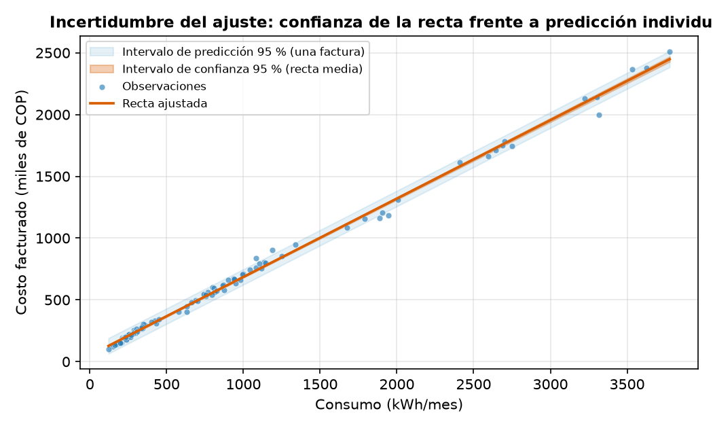
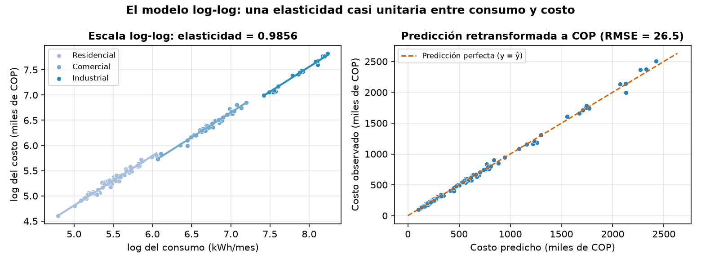
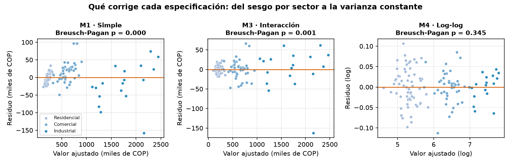
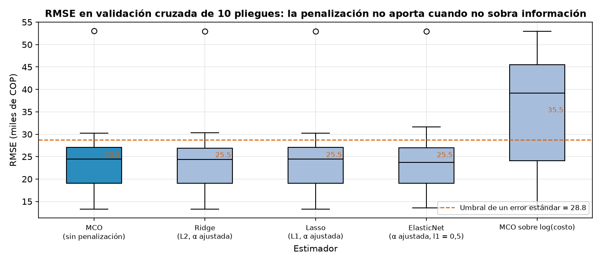
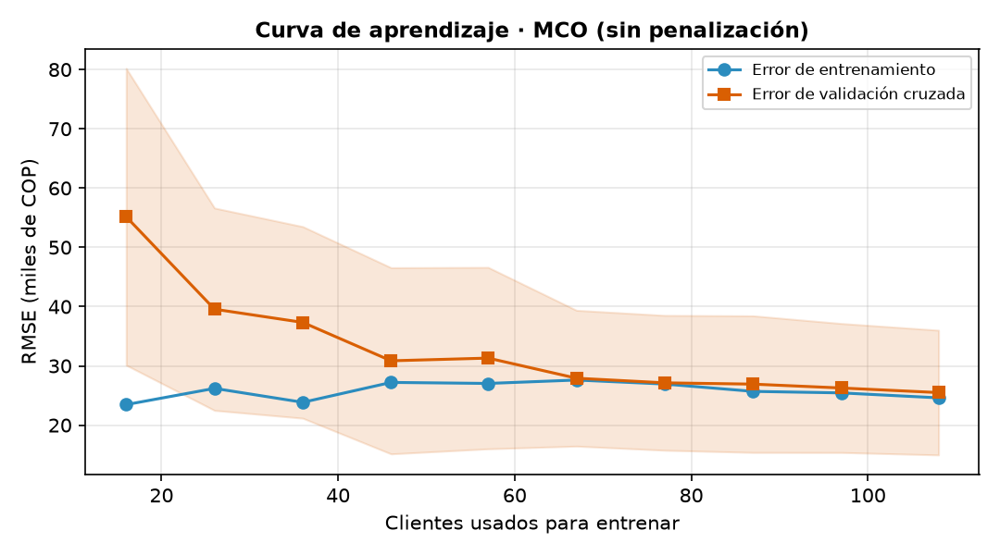
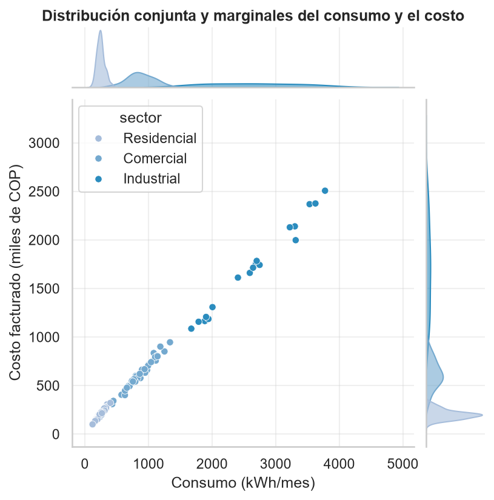
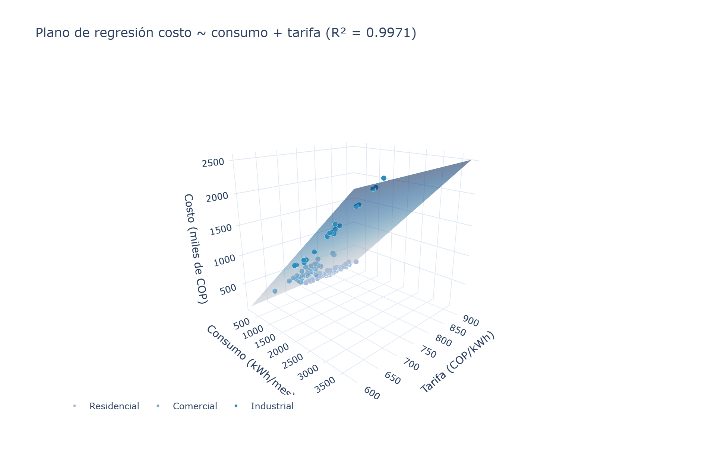
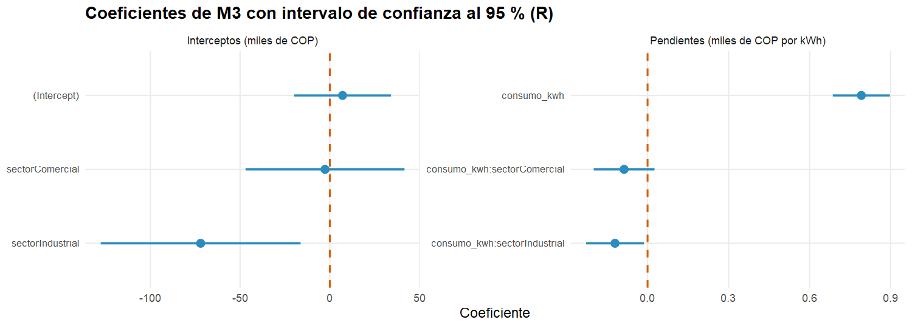

<div align="center">
    
</div>

# Análisis de Regresión y Visualización Avanzada

## 📋 Información General

<div align="center">
    
</div>

| Aspecto | Detalles |
|--------|----------|
| **Autor** | Andrés Giovanny Rubiano Muñoz "Andy Rubiano" |
| **Correo** | arubiano67@unisalle.edu.co |
| **Asignatura** | Ciencia de Datos — Actividad 4 |
| **Programa** | Maestría en Inteligencia Artificial |
| **Universidad** | Universidad de La Salle |
| **Herramientas** | Python 3.14 (statsmodels · scikit-learn · seaborn · Plotly) y R 4.6 (`lm` · ggplot2) |
| **Año** | 2026 |
| **Estado** | Completado |

---

## 🎯 Descripción del Proyecto

Laboratorio de **análisis de regresión y visualización avanzada** sobre el conjunto de datos de consumo energético mensual de **120 clientes** de una empresa distribuidora (sectores Residencial, Comercial e Industrial) que vienen usando las actividades anteriores. Mantener el mismo conjunto es deliberado: los datos ya están descritos, de modo que todo el esfuerzo se concentra en modelarlos y en comunicar el modelo.

El laboratorio persigue una historia con cuatro giros:

1. **Una recta que ajusta casi perfecto y aun así está mal.** La regresión simple `costo ~ consumo` alcanza un R² de **0,9969**, pero sus residuos no son ruido: se ordenan por sector y las pruebas de Breusch-Pagan y Jarque-Bera rechazan homocedasticidad y normalidad.
2. **El diagnóstico se convierte en especificación.** Al entrar el sector y su interacción con el consumo, cada grupo obtiene su propia pendiente, que resulta ser **su tarifa en COP/kWh**, verificable contra el cociente `costo/consumo` sin pasar por la regresión.
3. **El mejor modelo no es el de mayor R².** Un modelo **log-log** con cuatro parámetros es el único de los cuatro que satisface todos los supuestos, y su pendiente —la elasticidad **0,9856**, con intervalo que contiene a 1— dice algo que ningún R² dice: la facturación es proporcional al consumo.
4. **Validar no es ajustar.** `scikit-learn` repite las especificaciones con partición estratificada, validación cruzada de 10 pliegues y búsqueda de hiperparámetros: Ridge, Lasso y ElasticNet convergen a penalización nula y quedan empatados con mínimos cuadrados, así que la regla de un error estándar selecciona el modelo más simple.

Todo el ajuste se **verifica de forma cruzada en R** con `lm()`, que reproduce los seis coeficientes del modelo múltiple con **diferencia máxima de 0,0000**.

### Objetivos Principales

- Cuantificar la asociación entre consumo y costo, y ajustar la regresión lineal simple con `statsmodels`.
- Diagnosticar los supuestos del modelo y traducir sus fallas en una especificación múltiple mejor.
- Comparar cuatro modelos con criterios que no se dejan engañar por el R² (AIC, BIC, RMSE y pruebas de supuestos).
- Validar la capacidad predictiva con `scikit-learn` y decidir entre modelos empatados con un criterio explícito.
- Comunicar los resultados con visualización avanzada: figuras estáticas de alta densidad en seaborn y piezas interactivas en Plotly, incluido un tablero de cuatro paneles.
- Confirmar cada cifra con una implementación independiente en R (`lm`, `anova`, ggplot2 y graficación base).

---

## 📚 Estructura del Repositorio

```
.
├── README.md                                     # Este archivo
├── requirements.txt                              # Dependencias de Python
├── .gitignore                                    # Excluye venv/, __pycache__/, .Rhistory, .vscode/
├── data/
│   ├── dataset/
│   │   └── consumo_energia.csv                   # Dataset generado (semilla 42, reproducible)
│   └── processed/
│       ├── freq_table.csv                        # Base heredada: distribución de frecuencias
│       ├── central_tendency.csv                  # Base heredada: media, mediana y moda
│       ├── dispersion.csv                        # Base heredada: rango, varianza, σ, CV, IQR
│       ├── correlaciones.csv                     # Pearson y Spearman, global y por sector
│       ├── regresion_simple.csv                  # Coeficientes de M1 con IC al 95 %
│       ├── diagnostico_simple.csv                # Breusch-Pagan, Jarque-Bera, Durbin-Watson, RESET
│       ├── sesgo_por_sector.csv                  # Residuo medio de M1 dentro de cada sector
│       ├── comparacion_modelos.csv               # M1 a M4: R², AIC, BIC, RMSE y supuestos
│       ├── anova_modelos.csv                     # Contraste F entre modelos anidados
│       ├── regresion_multiple.csv                # Coeficientes de M3 con IC y VIF
│       ├── regresion_loglog.csv                  # Coeficientes de M4 y elasticidad
│       ├── tarifas_estimadas.csv                 # Pendiente estimada vs. tarifa observada
│       ├── multicolinealidad.csv                 # VIF y número de condición según parametrización
│       ├── sklearn_metricas.csv                  # Cinco estimadores en prueba y validación cruzada
│       ├── importancia_permutacion.csv           # Caída de R² al permutar cada variable
│       ├── curva_aprendizaje.csv                 # RMSE frente al tamaño de entrenamiento
│       ├── matriz_correlacion.csv                # Matriz completa incluidas las variables en log
│       ├── inventario_visualizaciones.csv        # Qué aporta cada figura avanzada
│       ├── comparacion_modelos_r.csv             # Recálculo de las métricas en R
│       ├── regresion_multiple_r.csv              # Coeficientes de M3 estimados con lm()
│       └── verificacion_cruzada.csv              # Diferencia coeficiente a coeficiente Python vs. R
├── public/
│   └── assets/
│       └── images/
│           ├── Logo.png                          # Logo institucional
│           ├── author/                           # Foto del autor
│           └── figures/
│               ├── python/
│               │   ├── statistics/               # 5 figuras heredadas de la base descriptiva
│               │   ├── regression/               # 9 figuras de ajuste, diagnóstico y validación
│               │   ├── advanced/                 # 5 figuras avanzadas en seaborn
│               │   └── dashboard/                # 3 piezas interactivas de Plotly (HTML + PNG)
│               └── r/
│                   ├── statistics/               # 5 réplicas heredadas en R base
│                   └── regression/               # 4 figuras en ggplot2 + 2 diagnósticos base
└── utils/
    └── codes/
        ├── descriptive_stats.py                  # Fase 0 · dataset y base descriptiva
        ├── descriptive_stats.R                   # Fase 0 · verificación descriptiva en R
        ├── simple_regression.py                  # Fase 1 · correlación, M1 y diagnóstico
        ├── multiple_regression.py                # Fase 2 · M2, M3, M4 y comparación
        ├── ml_regression.py                      # Fase 3 · validación con scikit-learn
        ├── advanced_viz.py                       # Fase 4 · seaborn y tablero de Plotly
        └── regression.R                          # Fase 5 · verificación cruzada y ggplot2
```

---

## 🧪 Pipeline del Laboratorio

El flujo es **secuencial**: la Fase 0 genera el dataset que consumen todas las demás, la Fase 4 lee las tablas de las Fases 2 y 3 para no recalcular nada, y la Fase 5 cierra el circuito comparando contra las estimaciones de Python.

| Fase | Script | Qué produce |
|---|---|---|
| 0 | [`descriptive_stats.py`](utils/codes/descriptive_stats.py) · [`.R`](utils/codes/descriptive_stats.R) | Dataset reproducible y su base descriptiva (heredados) |
| 1 | [`simple_regression.py`](utils/codes/simple_regression.py) | Correlaciones, modelo M1, pruebas de supuestos y 4 figuras |
| 2 | [`multiple_regression.py`](utils/codes/multiple_regression.py) | Modelos M2, M3 y M4, ANOVA, VIF, tarifas y 5 figuras |
| 3 | [`ml_regression.py`](utils/codes/ml_regression.py) | Partición estratificada, validación cruzada, 5 estimadores y 3 figuras |
| 4 | [`advanced_viz.py`](utils/codes/advanced_viz.py) | 5 figuras de seaborn y 3 piezas interactivas de Plotly |
| 5 | [`regression.R`](utils/codes/regression.R) | Recálculo con `lm()`, verificación cruzada y 6 figuras |

**Características clave:**

- **Reproducibilidad:** semilla fija (`default_rng(42)` en la generación y `random_state=42` en todas las particiones); cualquier ejecución produce las mismas cifras.
- **Sin fugas de información:** el escalado y la codificación viven dentro de un `Pipeline`, de modo que se ajustan solo con los datos de entrenamiento.
- **Comparaciones legítimas:** el modelo log-log se retransforma con el estimador de suavizado de Duan y su AIC se corrige por el jacobiano antes de compararlo con los modelos en escala original.
- **Verificación cruzada:** `lm()` reproduce los seis coeficientes de M3 con diferencia máxima **0,0000**; el AIC de R difiere en exactamente **2,0** por contar la varianza residual como parámetro.
- **Rutas:** Python las resuelve desde la ubicación del script (`Path(__file__)`); R usa rutas relativas a la raíz del proyecto, así que debe ejecutarse desde ahí.

---

## ⚙️ Requisitos

### Python

> ⚠️ **Versión:** Python 3.10 o superior (probado en **3.14.7**), con entorno virtual dedicado (`venv/`).

| Dependencia | Versión probada | Uso |
|---|---|---|
| `numpy` | 2.5.2 | Cálculo numérico y mallas de predicción |
| `pandas` | 3.0.5 | Manejo del dataset y de todas las tablas |
| `statsmodels` | 0.14.6 | Estimación por MCO, inferencia y pruebas de supuestos |
| `scikit-learn` | 1.9.0 | Pipelines, validación cruzada, regularización e importancia |
| `scipy` | 1.18.0 | Coeficientes de Pearson y Spearman |
| `matplotlib` | 3.11.1 | Figuras de ajuste, diagnóstico y validación |
| `seaborn` | 0.13.2 | Visualización estadística avanzada |
| `plotly` | 6.9.0 | Figuras interactivas y tablero |
| `kaleido` | 1.3.0 | Motor que exporta las figuras de Plotly a PNG |

El resto de entradas de [`requirements.txt`](requirements.txt) son dependencias transitivas.

### R

- **R 4.x** (probado en 4.6.1) con **ggplot2 4.0.3**: `install.packages("ggplot2")`.
- `lm()`, `anova()`, `confint()` y `plot(modelo)` son parte de la instalación base.
- Los dispositivos PNG se abren con `type = "cairo"` para obtener texto antialiasado.
- Editor: RStudio Desktop o VS Code con la extensión **R** (REditorSupport) + `languageserver`.

---

## 🛠️ Ejecución

> Todos los comandos se lanzan **desde la raíz del proyecto**, porque los scripts de R resuelven sus rutas de forma relativa.

```bash
# 1. Entorno de Python
py -3.14 -m venv venv           # o `python -m venv venv` si 3.14 ya es el intérprete por defecto
source venv/Scripts/activate    # Git Bash (en PowerShell: venv\Scripts\activate)
pip install -r requirements.txt

# 2. Fase 0: dataset y base descriptiva
python utils/codes/descriptive_stats.py

# 3. Fases 1 a 4: regresión, validación y visualización avanzada
python utils/codes/simple_regression.py
python utils/codes/multiple_regression.py
python utils/codes/ml_regression.py
python utils/codes/advanced_viz.py

# 4. Fase 5: verificación cruzada en R
Rscript utils/codes/regression.R
```

Si `Rscript` no está en el `PATH` de Git Bash, añádelo a la sesión antes del último paso:

```bash
export PATH="/c/Program Files/R/R-4.6.1/bin/x64:$PATH"
```

> ℹ️ La Fase 4 lee `comparacion_modelos.csv` y `regresion_multiple.csv`, y la Fase 5 compara contra esta última: ambas deben ejecutarse **después** de la Fase 2.

---

## 📈 Fase 1 · Correlación y regresión lineal simple

La asociación entre consumo y costo es casi perfecta, y lo es también dentro de cada sector, así que no se trata de una correlación espuria producida al mezclar tres poblaciones de escalas distintas.

| Grupo | n | Pearson r | R² | Spearman ρ | Tarifa media (COP/kWh) |
|---|---|---|---|---|---|
| **Global** | 120 | **0,9984** | 0,9969 | 0,9947 | 758,1 |
| Residencial | 62 | 0,9820 | 0,9643 | 0,9671 | 821,8 |
| Comercial | 40 | 0,9866 | 0,9733 | 0,9799 | 710,4 |
| Industrial | 18 | 0,9937 | 0,9875 | 0,9856 | 645,0 |

El modelo estimado es **ŷ = 50,42 + 0,6349·x**, con ambos coeficientes significativos (p < 10⁻²³).

| Término | Coeficiente | Error estándar | t | IC 95 % |
|---|---|---|---|---|
| Intercepto | 50,4228 | 3,9229 | 12,85 | [42,65 ; 58,19] |
| Consumo (kWh) | 0,6349 | 0,0033 | 193,40 | [0,6283 ; 0,6414] |

| | |
|---|---|
|  |  |
| **Ajuste por mínimos cuadrados** — el color marca el sector, que todavía no forma parte del modelo | **Confianza frente a predicción** — la banda estrecha acota dónde está la recta media; la ancha, dónde caerá una factura individual |

### El diagnóstico contradice al R²

<div align="center">
    
</div>

| Prueba | Estadístico | p-valor | Conclusión |
|---|---|---|---|
| Breusch-Pagan (homocedasticidad) | 23,018 | 1,6 × 10⁻⁶ | **Se rechaza** |
| Jarque-Bera (normalidad) | 214,134 | 3,2 × 10⁻⁴⁷ | **Se rechaza** |
| Durbin-Watson (independencia) | 2,275 | — | No se rechaza |
| RESET de Ramsey (especificación) | 0,896 | 0,346 | No se rechaza |

Que el RESET **no** rechace y Breusch-Pagan **sí** es informativo: el problema no es la forma funcional —la relación es lineal— sino que falta una variable. El residuo medio dentro de cada sector lo confirma, porque en un modelo correcto debería ser nulo en cualquier subgrupo:

| Sector | n | Residuo medio (miles COP) | Desviación estándar |
|---|---|---|---|
| Residencial | 62 | **−4,39** | 13,36 |
| Comercial | 40 | **+15,45** | 28,20 |
| Industrial | 18 | **−19,23** | 57,51 |

<div align="center">
    
</div>

---

## 📐 Fase 2 · Regresión múltiple y selección de modelo

Los cuatro modelos, de complejidad creciente:

| Modelo | Especificación | k | R² ajustado | AIC | BIC | RMSE | Breusch-Pagan | Jarque-Bera |
|---|---|---|---|---|---|---|---|---|
| M1 | `costo ~ consumo` | 2 | 0,9968 | 1 168,9 | 1 174,5 | 31,03 | 1,6 × 10⁻⁶ | 3,2 × 10⁻⁴⁷ |
| M2 | `costo ~ consumo + sector` | 4 | 0,9978 | 1 126,3 | 1 137,5 | 25,55 | 7,4 × 10⁻⁴ | 1,6 × 10⁻²⁵⁴ |
| M3 | `costo ~ consumo × sector` | 6 | **0,9979** | 1 123,2 | 1 139,9 | **24,80** | 1,2 × 10⁻³ | 1,2 × 10⁻²⁴⁸ |
| **M4** | `log(costo) ~ log(consumo) + sector` | 4 | 0,9975 | **1 015,7** | **1 026,8** | 26,54 | **0,345** | **0,885** |

> El AIC y el BIC de M4 incluyen la corrección por el jacobiano (**+1 435,0**), sin la cual comparar un modelo en logaritmos contra uno en escala original carece de sentido. Su RMSE se calcula sobre predicciones retransformadas con el estimador de suavizado de Duan (factor **1,0008**).

El contraste F confirma que cada término añadido aporta: M2 mejora sobre M1 con **F = 28,71** (p < 10⁻¹⁰) y M3 sobre M2 con **F = 3,48** (p = 0,034).

<div align="center">
    
</div>

Los tres paneles usan magnitudes con **cero natural** —varianza no explicada, ΔBIC y RMSE— en lugar de graficar R² con el eje truncado, que es la forma habitual de exagerar diferencias en la cuarta cifra decimal.

### Las pendientes son tarifas

<div align="center">
    
</div>

| Sector | Pendiente estimada | Tarifa implícita (COP/kWh) | Tarifa media observada | Diferencia |
|---|---|---|---|---|
| Residencial | 0,7916 | 791,6 | 821,8 | −3,67 % |
| Comercial | 0,7048 | 704,8 | 710,4 | −0,79 % |
| Industrial | 0,6710 | 671,0 | 645,0 | +4,03 % |

La tarifa observada se calcula como `costo × 1000 / consumo`, **sin pasar por la regresión**: que las pendientes la reproduzcan con menos del 4 % de diferencia es una validación externa del modelo. El descuento por escala queda cuantificado: el sector Industrial paga **151 COP/kWh menos** que el Residencial.

### Multicolinealidad: un problema de parametrización

| Especificación | VIF máximo | Número de condición | R² | RMSE |
|---|---|---|---|---|
| M3 sin centrar | 522,47 | 20 803,7 | 0,99799 | 24,80 |
| M3 centrado en la media global | 398,68 | 25 962,4 | 0,99799 | 24,80 |
| **M3 centrado dentro de cada sector** | **43,55** | **1 209,2** | 0,99799 | 24,80 |

Centrar en la media global —el remedio de manual— **no funciona aquí**, porque el problema no es de escala sino de que los tres sectores ocupan tramos de consumo casi disjuntos. Centrar dentro de cada grupo sí desacopla el término de interacción y reduce el VIF en un factor de 12, con **exactamente el mismo ajuste**: la misma información, escrita en una base mejor condicionada.

### El modelo log-log y la elasticidad

<div align="center">
    
</div>

| Término | Coeficiente | Error estándar | p-valor | IC 95 % |
|---|---|---|---|---|
| Intercepto (Residencial) | −0,1186 | 0,0840 | 0,161 | [−0,285 ; 0,048] |
| Sector Comercial | −0,1272 | 0,0211 | 1,9 × 10⁻⁸ | [−0,169 ; −0,086] |
| Sector Industrial | −0,2076 | 0,0378 | 2,4 × 10⁻⁷ | [−0,283 ; −0,133] |
| **log(consumo) · elasticidad** | **0,9856** | 0,0153 | 1,1 × 10⁻⁹² | **[0,9554 ; 1,0159]** |

Contrastar la elasticidad contra **uno** —y no contra cero, que aquí no significa nada— da t = −0,939 y p = 0,3495: **no se rechaza la proporcionalidad estricta**. Duplicar el consumo duplica la factura, y los coeficientes de sector se leen como descuentos porcentuales: −12,7 % en Comercial y −20,8 % en Industrial frente al Residencial.

<div align="center">
    
</div>

Esta figura resume la actividad entera: M1 tiene los residuos ordenados por sector, M3 los desordena pero conserva el abanico creciente, y M4 lo cierra. **M4 es el único que satisface los cuatro supuestos.**

---

## 🤖 Fase 3 · Validación con scikit-learn

Partición estratificada 70/30 (84 clientes de entrenamiento, 36 de prueba) y validación cruzada de 10 pliegues. Los tres estimadores penalizados eligen su α en una rejilla logarítmica con validación cruzada interna, para que la comparación con MCO no sea un empate amañado.

| Estimador | α elegida | R² prueba | RMSE prueba | MAPE prueba | R² CV | RMSE CV |
|---|---|---|---|---|---|---|
| **MCO (sin penalización)** | — | 0,9944 | 36,26 | 3,68 % | 0,9960 ± 0,0044 | 25,49 ± 10,53 |
| Ridge (L2) | 0,01 | 0,9944 | 36,29 | 3,68 % | 0,9960 ± 0,0044 | **25,45** ± 10,51 |
| Lasso (L1) | 0,01 | 0,9944 | 36,20 | 3,67 % | 0,9960 ± 0,0044 | 25,50 ± 10,52 |
| ElasticNet | 0,001 | 0,9943 | 36,45 | 3,74 % | 0,9959 ± 0,0045 | 25,46 ± 10,58 |
| MCO sobre log(costo) | — | 0,9926 | 41,62 | 4,34 % | 0,9933 ± 0,0057 | 35,49 ± 12,79 |

Las tres regularizaciones convergen al **extremo inferior de la rejilla**: los datos piden que no se les penalice. Las diferencias entre los cuatro primeros estimadores (25,45 a 25,50) son unas cincuenta veces menores que la desviación entre pliegues, así que elegir por el mínimo sería elegir por ruido. La **regla de un error estándar** —quedarse con el modelo más simple cuyo desempeño esté a menos de un error estándar del mejor, umbral 28,77— selecciona **MCO sin penalización**.

<div align="center">
    
</div>

| | |
|---|---|
|  |  |
| **Prueba retenida** — R² = 0,9944 y RMSE = 36,3 sobre 36 clientes que el modelo nunca vio; los residuos ya no muestran sesgo por sector | **Curva de aprendizaje** — las dos curvas convergen hacia 25 miles de COP: el error restante es ruido irreducible, no falta de datos |

La importancia por permutación confirma la jerarquía: permutar el consumo hunde el R² en **2,67** puntos, mientras que permutar el sector lo baja **0,057**. El sector afina el modelo; el consumo lo sostiene.

---

## 🎨 Fase 4 · Visualización avanzada

### seaborn · figuras estáticas de alta densidad

| | |
|---|---|
|  |  |
| **Matriz de dispersión** — cruza las tres variables continuas y pone la densidad en la diagonal: los sectores ocupan regiones casi disjuntas en cualquier plano | **Mapa de calor** — la tarifa correlaciona **−0,76** con el consumo, que es el descuento por escala antes de modelarlo |

<div align="center">
    
</div>

**`lmplot` con facetas** — una regresión independiente y su banda de confianza dentro de cada sector, cada panel en su propia escala para que el sector Industrial no aplaste a los otros dos.

| | |
|---|---|
|  |  |
| **`residplot` con suavizado local** — la curva lowess debe ser plana si el modelo capturó toda la estructura; en M1 no lo es, en M3 sí | **`jointplot`** — las marginales explican por qué la banda de predicción se ensancha: la densidad de clientes se agota antes que el recorrido del consumo |

### Plotly · piezas interactivas

<div align="center">
    
</div>

**[`dashboard_regresion.html`](public/assets/images/figures/python/dashboard/dashboard_regresion.html)** reúne las cuatro preguntas del análisis en una sola página —cómo ajusta, qué queda en los residuos, cuál modelo gana y qué coeficientes son distintos de cero— con botones que filtran los paneles por sector sin regenerar nada.

| | |
|---|---|
|  |  |
| **[`scatter_interactivo.html`](public/assets/images/figures/python/dashboard/scatter_interactivo.html)** — tendencia por sector con identificación de cada cliente al pasar el cursor y leyenda filtrable | **[`superficie_3d.html`](public/assets/images/figures/python/dashboard/superficie_3d.html)** — con dos regresores continuos el ajuste deja de ser una recta y pasa a ser un plano (R² = 0,9971), rotable en el navegador |

---

## 🔁 Fase 5 · Verificación cruzada en R

`lm()` reestima los mismos modelos y **coincide dígito a dígito** con `statsmodels`:

| Término | Python (`statsmodels`) | R (`lm`) | Diferencia |
|---|---|---|---|
| Intercepto (Residencial) | 7,1067 | 7,1067 | 0,0000 |
| Sector Comercial | −2,6594 | −2,6594 | 0,0000 |
| Sector Industrial | −71,9656 | −71,9656 | 0,0000 |
| Pendiente Residencial | 0,7916 | 0,7916 | 0,0000 |
| Δ pendiente Comercial | −0,0868 | −0,0868 | 0,0000 |
| Δ pendiente Industrial | −0,1206 | −0,1206 | 0,0000 |

> La comparación se empareja **por nombre de término**, no por posición: R ordena la matriz de diseño poniendo primero las variables continuas y `patsy` primero las categóricas. El AIC de R supera al de `statsmodels` en exactamente **2,0** porque cuenta la varianza residual como un parámetro adicional; la diferencia es constante y no altera el orden de los modelos.

| | |
|---|---|
|  |  |
| **`geom_smooth(method = "lm")`** — la gramática de gráficos declara el ajuste como una capa más, con su banda de confianza incluida | **`geom_pointrange`** — los mismos coeficientes e intervalos que estimó Python, separados por escala |

<div align="center">
    
</div>

<div align="center">
    
</div>

**El sesgo desaparece al incluir la interacción** — la misma comparación que en Python, resuelta con `facet_wrap`, para comprobar que el hallazgo no es un artefacto de una librería.

<div align="center">
    
</div>

**`plot(modelo)` de la graficación base** — las cuatro vistas canónicas del diagnóstico de un `lm`, con las observaciones influyentes etiquetadas. R las entrega en una sola llamada; en Python hubo que construirlas una por una.

---

## 🧠 Conclusiones

- **Un R² de 0,9969 puede acompañar a un modelo mal especificado.** La regresión simple ajusta casi perfecto y aun así falla en dos de los cuatro supuestos, con residuos medios de −4,4, +15,5 y −19,2 miles de COP según el sector. El diagnóstico, no la bondad de ajuste, es lo que detecta el problema.
- **Los coeficientes de un buen modelo tienen nombre.** Las pendientes de M3 son tarifas (791,6, 704,8 y 671,0 COP/kWh) que reproducen con menos del 4 % de error el cociente `costo/consumo` calculado directamente. Esa correspondencia es una validación externa que ningún criterio de información puede dar.
- **El mejor modelo no es el de mayor R² sino el que respeta sus supuestos.** M3 gana en RMSE (24,80) pero rechaza homocedasticidad y normalidad; M4, con dos parámetros menos, es el único que pasa todas las pruebas y además gana en AIC y BIC una vez corregido el jacobiano.
- **La elasticidad unitaria es el hallazgo de negocio.** Con IC 95 % [0,9554 ; 1,0159] no se rechaza que la facturación sea estrictamente proporcional al consumo; lo que separa a los sectores es un descuento fijo de −12,7 % y −20,8 % frente al Residencial, no un trato distinto ante el crecimiento del consumo.
- **Regularizar no siempre ayuda.** Con dos variables y 120 observaciones no sobra información que penalizar: Ridge, Lasso y ElasticNet eligen el α más pequeño de la rejilla y quedan empatados con MCO dentro del ruido de la validación cruzada. La regla de un error estándar convierte ese empate en una decisión reproducible a favor del modelo más simple.
- **La visualización avanzada no es adorno, es parte del diagnóstico.** El sesgo por sector se descubrió coloreando un gráfico de residuos, y el suavizado lowess de seaborn lo confirmó sin suponer forma funcional alguna. El tablero de Plotly traslada ese mismo razonamiento a un lector que no ejecuta código.
- **Dos implementaciones independientes coinciden dígito a dígito.** `lm()` reproduce los seis coeficientes de M3 con diferencia máxima 0,0000, y las discrepancias de convención —orden de la matriz de diseño y conteo de parámetros en el AIC— resultan explicables y constantes.

---

## 🔑 Palabras Clave

`Análisis de Regresión` · `Regresión Simple` · `Regresión Múltiple` · `statsmodels` · `scikit-learn` · `Diagnóstico de Supuestos` · `Multicolinealidad` · `Validación Cruzada` · `Regularización` · `Elasticidad` · `Visualización Avanzada` · `seaborn` · `Plotly` · `Dashboard Interactivo` · `ggplot2` · `R` · `Ciencia de Datos` · `Python`

---

## 📧 Contacto

**Andrés Giovanny Rubiano Muñoz**
Maestría en Inteligencia Artificial · Universidad de La Salle
arubiano67@unisalle.edu.co

---

## 📄 Derechos Reservados

© 2026 Andrés Giovanny Rubiano Muñoz (Andy Rubiano). Todos los derechos reservados.

Este laboratorio y su contenido —código, datos y documentación— son propiedad intelectual conjunta de:

- **Andrés Giovanny Rubiano Muñoz** (Andy Rubiano) — Autor
- **Universidad de La Salle** — Institución académica

El uso, reproducción o distribución requiere autorización previa escrita de los titulares de derechos.

---

<div align="center">
  Universidad de La Salle | Bogotá D. C., Colombia
</div>
