<div align="center">
    
</div>

# Análisis de Regresión y Visualización Avanzada

## 📋 Información General

<div align="center">
    
</div>

| Aspecto | Detalles |
|--------|----------|
| **Autor** | Andrés Giovanny Rubiano Muñoz "Andy Rubiano" |
| **Correo** | arubiano67@unisalle.edu.co |
| **Asignatura** | Ciencia de Datos — Actividad 4 |
| **Programa** | Maestría en Inteligencia Artificial |
| **Universidad** | Universidad de La Salle |
| **Herramientas** | Python 3.14 (statsmodels · scikit-learn · seaborn · Plotly) y R 4.6 (`lm` · ggplot2) |
| **Año** | 2026 |
| **Estado** | Completado |

---

## 🎯 Descripción del Proyecto

Laboratorio de **análisis de regresión y visualización avanzada** sobre el consumo energético mensual de **120 clientes** de una empresa distribuidora, repartidos en los sectores Residencial, Comercial e Industrial.

El análisis sigue una sola línea argumental:

1. **Una recta que ajusta casi perfecto y aun así está mal.** La regresión simple `costo ~ consumo` alcanza un R² de **0,9969**, pero sus residuos no son ruido: se ordenan por sector y las pruebas de Breusch-Pagan y Jarque-Bera rechazan homocedasticidad y normalidad.
2. **El diagnóstico se convierte en especificación.** Al entrar el sector y su interacción con el consumo, cada grupo obtiene su propia pendiente, que resulta ser **su tarifa en COP/kWh**, verificable contra el cociente `costo/consumo` sin pasar por la regresión.
3. **La mejora se confirma fuera de la muestra.** `scikit-learn` valida ambas especificaciones con partición estratificada y validación cruzada de 10 pliegues: el modelo múltiple reduce el error de predicción un **16,7 %** frente al simple.
4. **Todo se verifica en R.** `lm()` reproduce los seis coeficientes del modelo múltiple con **diferencia máxima de 0,0000**.

### Objetivos Principales

- Cuantificar la asociación entre consumo y costo y ajustar la regresión lineal simple con `statsmodels`.
- Diagnosticar los supuestos del modelo y traducir sus fallas en una especificación múltiple mejor.
- Comparar los modelos con criterios que no se dejan engañar por el R² (R² ajustado, AIC, BIC y RMSE).
- Validar la capacidad predictiva con `scikit-learn`.
- Comunicar los resultados con seaborn, Plotly y un tablero interactivo.
- Confirmar cada cifra con una implementación independiente en R (`lm`, `anova` y ggplot2).

---

## 📚 Estructura del Repositorio

```
.
├── README.md                             # Este archivo
├── requirements.txt                      # Dependencias de Python
├── .gitignore                            # Excluye venv/, __pycache__/, .Rhistory, .vscode/
├── data/
│   ├── dataset/
│   │   └── consumo_energia.csv           # Dataset generado (semilla 42, reproducible)
│   └── processed/
│       ├── correlaciones.csv             # Pearson y Spearman, global y por sector
│       ├── regresion_simple.csv          # Coeficientes de M1 con IC al 95 %
│       ├── diagnostico_simple.csv        # Breusch-Pagan, Jarque-Bera, Durbin-Watson, RESET
│       ├── sesgo_por_sector.csv          # Residuo medio de M1 dentro de cada sector
│       ├── comparacion_modelos.csv       # M1 a M3: R², AIC, BIC, RMSE y supuestos
│       ├── anova_modelos.csv             # Contraste F entre modelos anidados
│       ├── regresion_multiple.csv        # Coeficientes de M3 con IC al 95 %
│       ├── tarifas_estimadas.csv         # Pendiente estimada vs. tarifa observada
│       ├── sklearn_metricas.csv          # Prueba retenida y validación cruzada
│       ├── comparacion_modelos_r.csv     # Recálculo de las métricas en R
│       ├── regresion_multiple_r.csv      # Coeficientes de M3 estimados con lm()
│       └── verificacion_cruzada.csv      # Diferencia coeficiente a coeficiente Python vs. R
├── public/
│   └── assets/
│       └── images/
│           ├── Logo.png                  # Logo institucional
│           ├── author/                   # Foto del autor
│           └── figures/
│               ├── python/
│               │   ├── regression/       # 7 figuras de ajuste, diagnóstico y validación
│               │   ├── advanced/         # 4 figuras avanzadas en seaborn
│               │   └── dashboard/        # 2 piezas interactivas de Plotly (HTML + PNG)
│               └── r/
│                   └── regression/       # 3 figuras en ggplot2 + 1 diagnóstico base
└── utils/
    └── codes/
        ├── python/                       # Fases 0 a 4
        │   ├── dataset.py                # Fase 0 · generación del dataset
        │   ├── simple_regression.py      # Fase 1 · correlación, M1 y diagnóstico
        │   ├── multiple_regression.py    # Fase 2 · M2, M3 y comparación
        │   ├── ml_regression.py          # Fase 3 · validación con scikit-learn
        │   └── advanced_viz.py           # Fase 4 · seaborn y tablero de Plotly
        └── R/                            # Fase 5
            └── regression.R              # Fase 5 · verificación cruzada y ggplot2
```

---

## 🧪 Pipeline del Laboratorio

El flujo es **secuencial**: la Fase 0 genera el dataset que consumen las demás, la Fase 4 lee las tablas de la Fase 2 para no recalcular nada, y la Fase 5 cierra el circuito comparando contra las estimaciones de Python.

| Fase | Script | Qué produce |
|---|---|---|
| 0 | [`dataset.py`](utils/codes/python/dataset.py) | Dataset reproducible de 120 clientes |
| 1 | [`simple_regression.py`](utils/codes/python/simple_regression.py) | Correlaciones, modelo M1, pruebas de supuestos y 3 figuras |
| 2 | [`multiple_regression.py`](utils/codes/python/multiple_regression.py) | Modelos M2 y M3, ANOVA, tarifas y 3 figuras |
| 3 | [`ml_regression.py`](utils/codes/python/ml_regression.py) | Partición estratificada, validación cruzada y 1 figura |
| 4 | [`advanced_viz.py`](utils/codes/python/advanced_viz.py) | 4 figuras de seaborn y 2 piezas interactivas de Plotly |
| 5 | [`regression.R`](utils/codes/R/regression.R) | Recálculo con `lm()`, verificación cruzada y 4 figuras |

**Características clave:**

- **Reproducibilidad:** semilla fija (`default_rng(42)` en la generación y `random_state=42` en todas las particiones); cualquier ejecución produce las mismas cifras.
- **Sin fugas de información:** el escalado y la codificación viven dentro de un `Pipeline`, de modo que se ajustan solo con los datos de entrenamiento.
- **Verificación cruzada:** `lm()` reproduce los seis coeficientes de M3 con diferencia máxima **0,0000**; el AIC de R difiere en exactamente **2,0** por contar la varianza residual como parámetro.
- **Rutas:** Python las resuelve desde la ubicación del script (`Path(__file__)`); R usa rutas relativas a la raíz del proyecto, así que debe ejecutarse desde ahí.

---

## ⚙️ Requisitos

### Python

> ⚠️ **Versión:** Python 3.10 o superior (probado en **3.14.7**), con entorno virtual dedicado (`venv/`).

| Dependencia | Versión probada | Uso |
|---|---|---|
| `numpy` | 2.5.2 | Cálculo numérico y mallas de predicción |
| `pandas` | 3.0.5 | Manejo del dataset y de todas las tablas |
| `statsmodels` | 0.14.6 | Estimación por MCO, inferencia y pruebas de supuestos |
| `scikit-learn` | 1.9.0 | Pipelines y validación cruzada |
| `scipy` | 1.18.0 | Coeficientes de Pearson y Spearman |
| `matplotlib` | 3.11.1 | Figuras de ajuste, diagnóstico y validación |
| `seaborn` | 0.13.2 | Visualización estadística avanzada |
| `plotly` | 6.9.0 | Figuras interactivas y tablero |
| `kaleido` | 1.3.0 | Motor que exporta las figuras de Plotly a PNG |

### R

- **R 4.x** (probado en 4.6.1) con **ggplot2 4.0.3**: `install.packages("ggplot2")`.
- `lm()`, `anova()`, `confint()` y `plot(modelo)` son parte de la instalación base.
- Editor: RStudio Desktop o VS Code con la extensión **R** (REditorSupport) + `languageserver`.

---

## 🛠️ Ejecución

> Todos los comandos se lanzan **desde la raíz del proyecto**, porque los scripts de R resuelven sus rutas de forma relativa.

```bash
# 1. Entorno de Python
py -3.14 -m venv venv           # o `python -m venv venv` si 3.14 ya es el intérprete por defecto
source venv/Scripts/activate    # Git Bash (en PowerShell: venv\Scripts\activate)
pip install -r requirements.txt

# 2. Fases 0 a 4
python utils/codes/python/dataset.py
python utils/codes/python/simple_regression.py
python utils/codes/python/multiple_regression.py
python utils/codes/python/ml_regression.py
python utils/codes/python/advanced_viz.py

# 3. Fase 5: verificación cruzada en R
Rscript utils/codes/R/regression.R
```

Si `Rscript` no está en el `PATH` de Git Bash, añádelo a la sesión antes del último paso:

```bash
export PATH="/c/Program Files/R/R-4.6.1/bin/x64:$PATH"
```

---

## 📈 Fase 1 · Correlación y regresión lineal simple

La asociación entre consumo y costo es casi perfecta, y lo es también dentro de cada sector, así que no se trata de una correlación espuria producida al mezclar tres poblaciones de escalas distintas.

| Grupo | n | Pearson r | R² | Spearman ρ | Tarifa media (COP/kWh) |
|---|---|---|---|---|---|
| **Global** | 120 | **0,9984** | 0,9969 | 0,9947 | 758,1 |
| Residencial | 62 | 0,9820 | 0,9643 | 0,9671 | 821,8 |
| Comercial | 40 | 0,9866 | 0,9733 | 0,9799 | 710,4 |
| Industrial | 18 | 0,9937 | 0,9875 | 0,9856 | 645,0 |

El modelo estimado es **ŷ = 50,42 + 0,6349·x**, con ambos coeficientes significativos (p < 10⁻²³).

| Término | Coeficiente | Error estándar | t | IC 95 % |
|---|---|---|---|---|
| Intercepto | 50,4228 | 3,9229 | 12,85 | [42,65 ; 58,19] |
| Consumo (kWh) | 0,6349 | 0,0033 | 193,40 | [0,6283 ; 0,6414] |

<div align="center">
    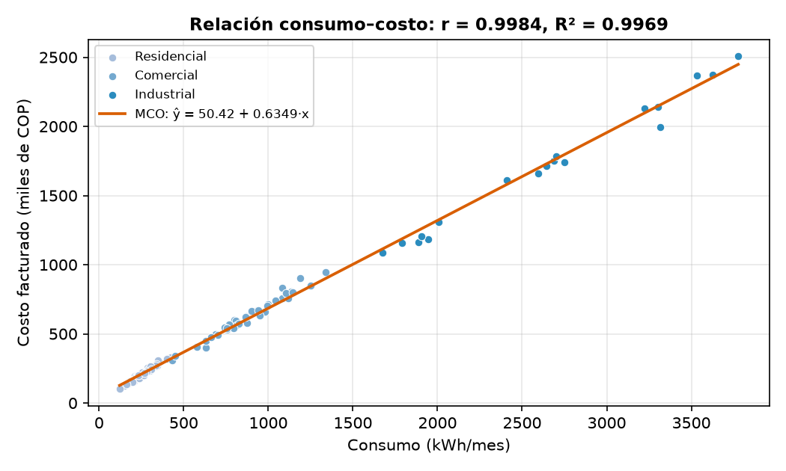
</div>

**Ajuste por mínimos cuadrados** — la banda estrecha acota dónde está la recta media; la ancha, dónde caerá una factura individual. El color marca el sector, que todavía no forma parte del modelo.

### El diagnóstico contradice al R²

<div align="center">
    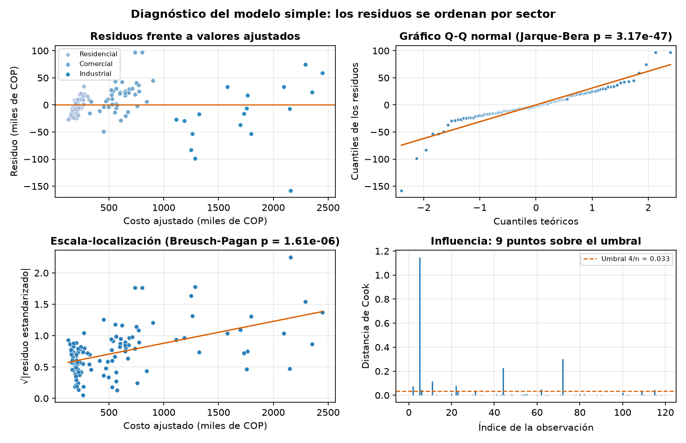
</div>

| Prueba | Estadístico | p-valor | Conclusión |
|---|---|---|---|
| Breusch-Pagan (homocedasticidad) | 23,018 | 1,6 × 10⁻⁶ | **Se rechaza** |
| Jarque-Bera (normalidad) | 214,134 | 3,2 × 10⁻⁴⁷ | **Se rechaza** |
| Durbin-Watson (independencia) | 2,275 | — | No se rechaza |
| RESET de Ramsey (especificación) | 0,896 | 0,346 | No se rechaza |

Que el RESET **no** rechace y Breusch-Pagan **sí** es informativo: el problema no es la forma funcional —la relación es lineal— sino que falta una variable. El residuo medio dentro de cada sector lo confirma, porque en un modelo correcto debería ser nulo en cualquier subgrupo:

| Sector | n | Residuo medio (miles COP) | Desviación estándar |
|---|---|---|---|
| Residencial | 62 | **−4,39** | 13,36 |
| Comercial | 40 | **+15,45** | 28,20 |
| Industrial | 18 | **−19,23** | 57,51 |

<div align="center">
    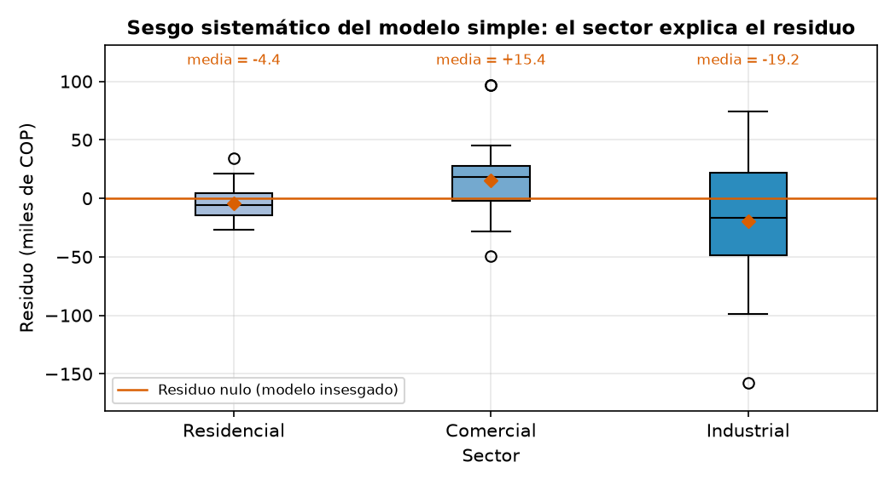
</div>

---

## 📐 Fase 2 · Regresión múltiple y selección de modelo

Los tres modelos, de complejidad creciente:

| Modelo | Especificación | k | R² ajustado | AIC | BIC | RMSE | Breusch-Pagan | Jarque-Bera |
|---|---|---|---|---|---|---|---|---|
| M1 | `costo ~ consumo` | 2 | 0,9968 | 1 168,9 | 1 174,5 | 31,03 | 1,6 × 10⁻⁶ | 3,2 × 10⁻⁴⁷ |
| M2 | `costo ~ consumo + sector` | 4 | 0,9978 | 1 126,3 | 1 137,5 | 25,55 | 7,4 × 10⁻⁴ | 1,6 × 10⁻²⁵⁴ |
| **M3** | `costo ~ consumo × sector` | 6 | **0,9979** | **1 123,2** | 1 139,9 | **24,80** | 1,2 × 10⁻³ | 1,2 × 10⁻²⁴⁸ |

El contraste F confirma que cada término añadido aporta: M2 mejora sobre M1 con **F = 28,71** (p < 10⁻¹⁰) y M3 sobre M2 con **F = 3,48** (p = 0,034).

<div align="center">
    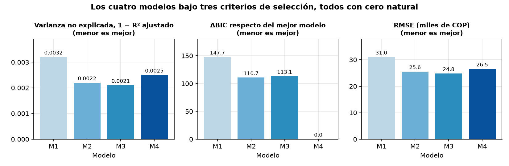
</div>

Los tres paneles usan magnitudes con **cero natural** —varianza no explicada, ΔBIC y RMSE— en lugar de graficar R² con el eje truncado, que es la forma habitual de exagerar diferencias en la cuarta cifra decimal.

### Las pendientes son tarifas

<div align="center">
    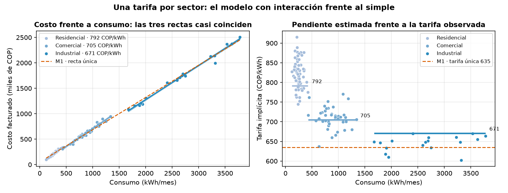
</div>

| Sector | Pendiente estimada | Tarifa implícita (COP/kWh) | Tarifa media observada | Diferencia |
|---|---|---|---|---|
| Residencial | 0,7916 | 791,6 | 821,8 | −3,67 % |
| Comercial | 0,7048 | 704,8 | 710,4 | −0,79 % |
| Industrial | 0,6710 | 671,0 | 645,0 | +4,03 % |

La tarifa observada se calcula como `costo × 1000 / consumo`, **sin pasar por la regresión**: que las pendientes la reproduzcan con menos del 4 % de diferencia es una validación externa del modelo. El descuento por escala queda cuantificado: el sector Industrial paga **121 COP/kWh menos** que el Residencial.

<div align="center">
    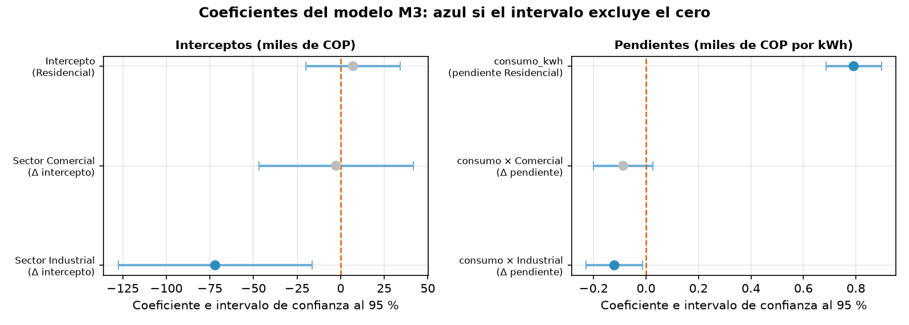
</div>

---

## 🤖 Fase 3 · Validación con scikit-learn

Partición estratificada 70/30 (84 clientes de entrenamiento, 36 de prueba) y validación cruzada de 10 pliegues sobre las dos especificaciones centrales.

| Estimador | R² prueba | RMSE prueba | MAPE prueba | R² CV | RMSE CV |
|---|---|---|---|---|---|
| MCO simple (solo consumo) | 0,9934 | 39,27 | 5,12 % | 0,9942 | 30,61 ± 10,01 |
| **MCO múltiple (consumo × sector)** | **0,9944** | **36,26** | **3,68 %** | **0,9960** | **25,49** ± 10,53 |

Añadir el sector **también mejora fuera de la muestra**: el RMSE en validación cruzada cae un **16,7 %**. La ganancia no es un artefacto del ajuste dentro de la muestra, que es lo que un R² creciente por sí solo no puede descartar.

<div align="center">
    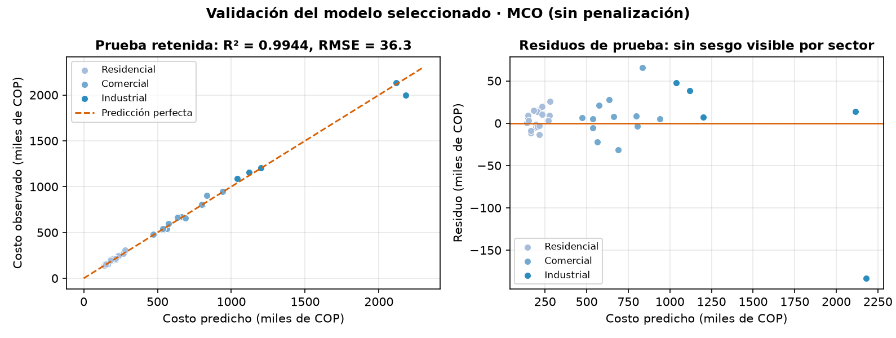
</div>

Sobre los 36 clientes que el modelo nunca vio, el R² es **0,9944** y el error porcentual absoluto medio, **3,68 %**. Los residuos ya no muestran el sesgo por sector que delataba al modelo simple.

---

## 🎨 Fase 4 · Visualización avanzada

### seaborn · figuras estáticas de alta densidad

| | |
|---|---|
|  |  |
| **Matriz de dispersión** — cruza las tres variables continuas y pone la densidad en la diagonal: los sectores ocupan regiones casi disjuntas en cualquier plano | **Mapa de calor** — la tarifa correlaciona **−0,76** con el consumo, que es el descuento por escala antes de modelarlo |

<div align="center">
    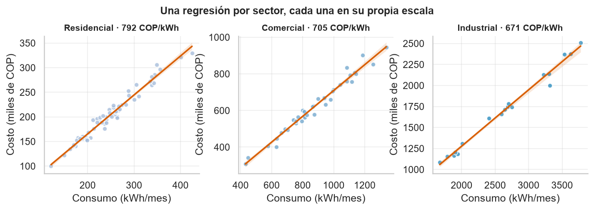
</div>

**`lmplot` con facetas** — una regresión independiente y su banda de confianza dentro de cada sector, cada panel en su propia escala para que el sector Industrial no aplaste a los otros dos.

<div align="center">
    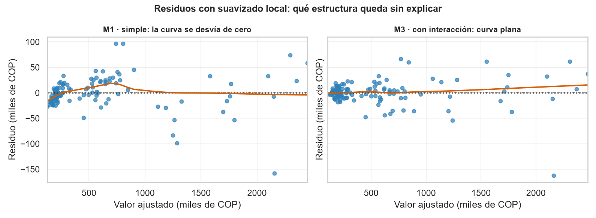
</div>

**`residplot` con suavizado local** — la curva lowess debe ser plana si el modelo capturó toda la estructura; en M1 no lo es, en M3 sí.

### Plotly · piezas interactivas

<div align="center">
    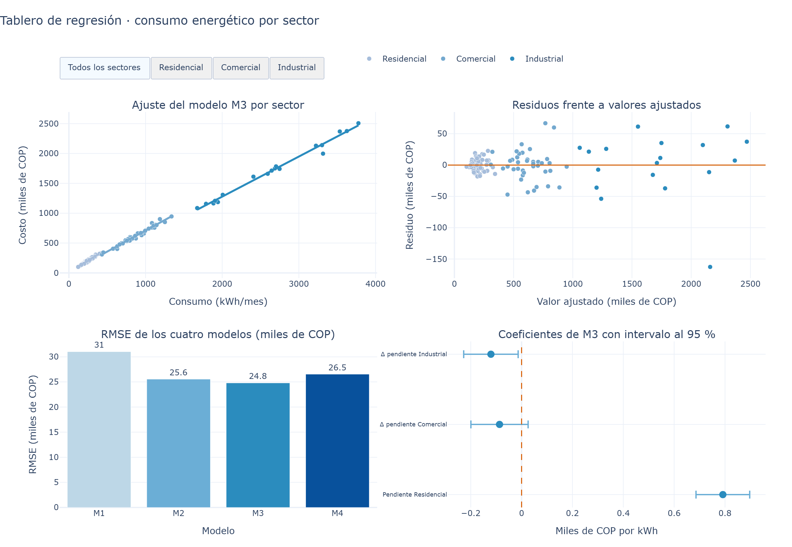
</div>

**[`dashboard_regresion.html`](public/assets/images/figures/python/dashboard/dashboard_regresion.html)** reúne las cuatro preguntas del análisis en una sola página —cómo ajusta, qué queda en los residuos, cuál modelo gana y qué coeficientes son distintos de cero— con botones que filtran los paneles por sector sin regenerar nada.

<div align="center">
    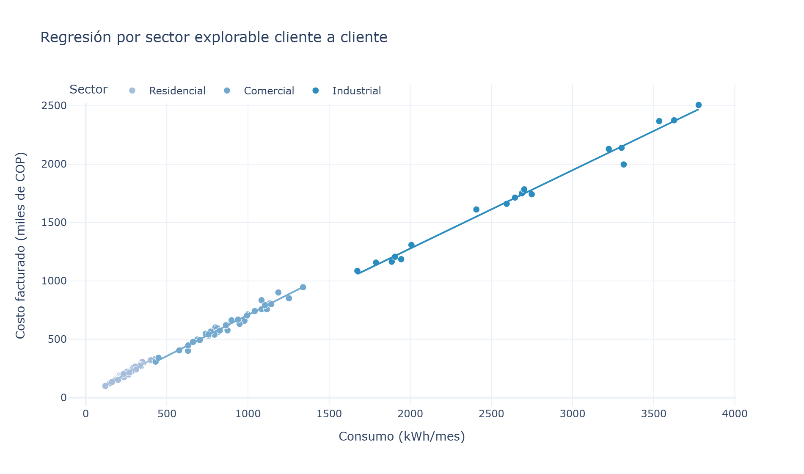
</div>

**[`scatter_interactivo.html`](public/assets/images/figures/python/dashboard/scatter_interactivo.html)** — tendencia por sector con identificación de cada cliente al pasar el cursor y leyenda filtrable.

---

## 🔁 Fase 5 · Verificación cruzada en R

`lm()` reestima los mismos modelos y **coincide dígito a dígito** con `statsmodels`:

| Término | Python (`statsmodels`) | R (`lm`) | Diferencia |
|---|---|---|---|
| Intercepto (Residencial) | 7,1067 | 7,1067 | 0,0000 |
| Sector Comercial | −2,6594 | −2,6594 | 0,0000 |
| Sector Industrial | −71,9656 | −71,9656 | 0,0000 |
| Pendiente Residencial | 0,7916 | 0,7916 | 0,0000 |
| Δ pendiente Comercial | −0,0868 | −0,0868 | 0,0000 |
| Δ pendiente Industrial | −0,1206 | −0,1206 | 0,0000 |

> La comparación se empareja **por nombre de término**, no por posición: R ordena la matriz de diseño poniendo primero las variables continuas y `patsy` primero las categóricas. El AIC de R supera al de `statsmodels` en exactamente **2,0** porque cuenta la varianza residual como un parámetro adicional; la diferencia es constante y no altera el orden de los modelos.

| | |
|---|---|
| 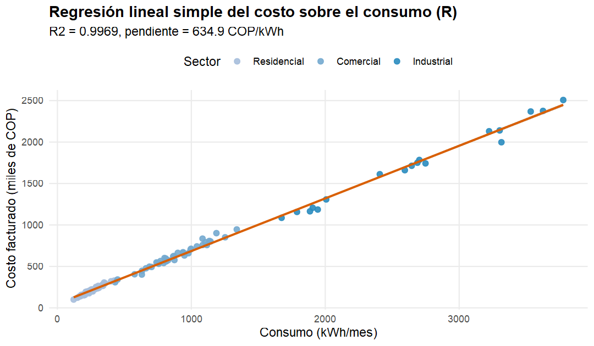 | 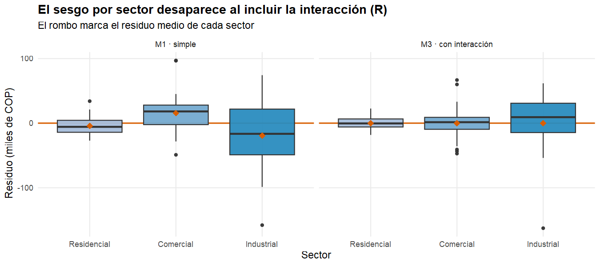 |
| **`geom_smooth(method = "lm")`** — la gramática de gráficos declara el ajuste como una capa más, con su banda de confianza incluida | **El sesgo desaparece al incluir la interacción** — el mismo hallazgo de Python, resuelto con `facet_wrap` |

<div align="center">
    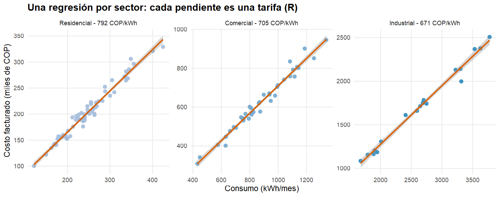
</div>

<div align="center">
    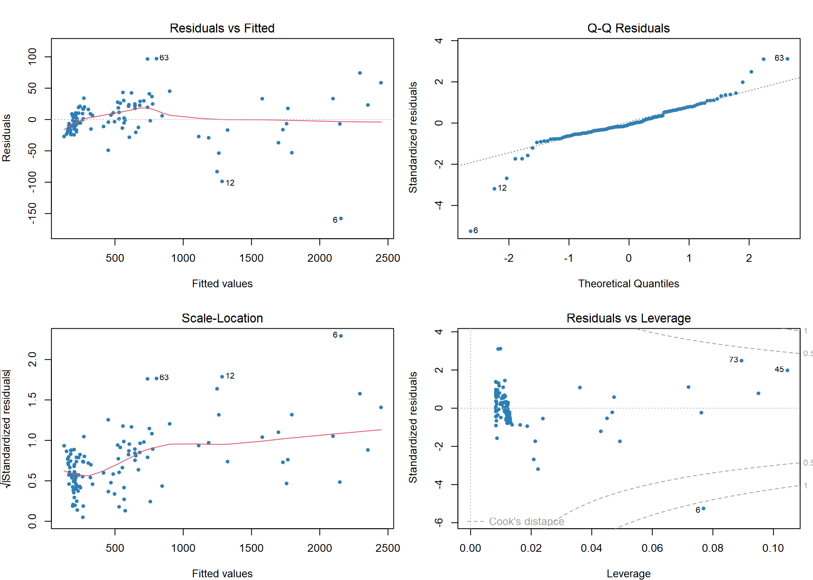
</div>

**`plot(modelo)` de la graficación base** — las cuatro vistas canónicas del diagnóstico de un `lm`, con las observaciones influyentes etiquetadas. R las entrega en una sola llamada; en Python hubo que construirlas una por una.

---

## 🧠 Conclusiones

- **Un R² de 0,9969 puede acompañar a un modelo mal especificado.** La regresión simple ajusta casi perfecto y aun así falla en dos de los cuatro supuestos, con residuos medios de −4,4, +15,5 y −19,2 miles de COP según el sector. El diagnóstico, no la bondad de ajuste, es lo que detecta el problema.
- **Los coeficientes de un buen modelo tienen nombre.** Las pendientes de M3 son tarifas (791,6, 704,8 y 671,0 COP/kWh) que reproducen con menos del 4 % de error el cociente `costo/consumo` calculado directamente. Esa correspondencia es una validación externa que ningún criterio de información puede dar.
- **El descuento por escala queda cuantificado.** El sector Industrial paga 121 COP/kWh menos que el Residencial por cada unidad consumida, una cifra directamente utilizable para revisar la política tarifaria.
- **La mejora se sostiene fuera de la muestra.** La validación cruzada de 10 pliegues confirma que el modelo múltiple reduce el error de predicción un 16,7 % frente al simple, y sobre 36 clientes nunca vistos alcanza un R² de 0,9944 con un error porcentual medio del 3,68 %.
- **Queda una limitación reconocida.** M3 corrige el sesgo por sector pero sigue rechazando la homocedasticidad (Breusch-Pagan p = 1,2 × 10⁻³): el error crece con el tamaño de la factura, así que los intervalos de predicción de los clientes grandes deben leerse con cautela.
- **La visualización avanzada no es adorno, es parte del diagnóstico.** El sesgo por sector se descubrió coloreando un gráfico de residuos, y el suavizado lowess de seaborn lo confirmó sin suponer forma funcional alguna. El tablero de Plotly traslada ese mismo razonamiento a un lector que no ejecuta código.
- **Dos implementaciones independientes coinciden dígito a dígito.** `lm()` reproduce los seis coeficientes de M3 con diferencia máxima 0,0000, y las discrepancias de convención —orden de la matriz de diseño y conteo de parámetros en el AIC— resultan explicables y constantes.

---

## 🔑 Palabras Clave

`Análisis de Regresión` · `Regresión Simple` · `Regresión Múltiple` · `statsmodels` · `scikit-learn` · `Diagnóstico de Supuestos` · `Validación Cruzada` · `Visualización Avanzada` · `seaborn` · `Plotly` · `Dashboard Interactivo` · `ggplot2` · `R` · `Ciencia de Datos` · `Python`

---

## 📧 Contacto

**Andrés Giovanny Rubiano Muñoz**
Maestría en Inteligencia Artificial · Universidad de La Salle
arubiano67@unisalle.edu.co

---

## 📄 Derechos Reservados

© 2026 Andrés Giovanny Rubiano Muñoz (Andy Rubiano). Todos los derechos reservados.

Este laboratorio y su contenido —código, datos y documentación— son propiedad intelectual conjunta de:

- **Andrés Giovanny Rubiano Muñoz** (Andy Rubiano) — Autor
- **Universidad de La Salle** — Institución académica

El uso, reproducción o distribución requiere autorización previa escrita de los titulares de derechos.

---

<div align="center">
  Universidad de La Salle | Bogotá D. C., Colombia
</div>
